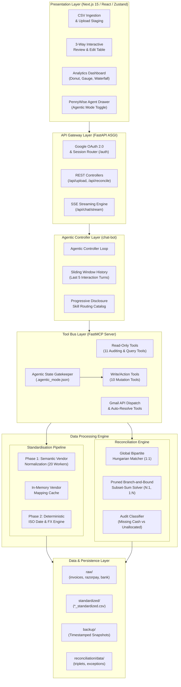
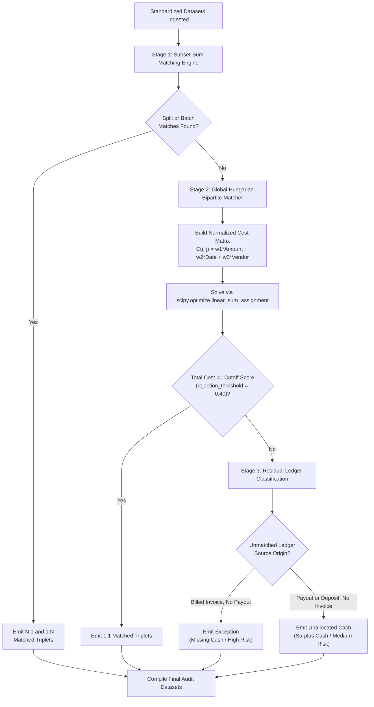
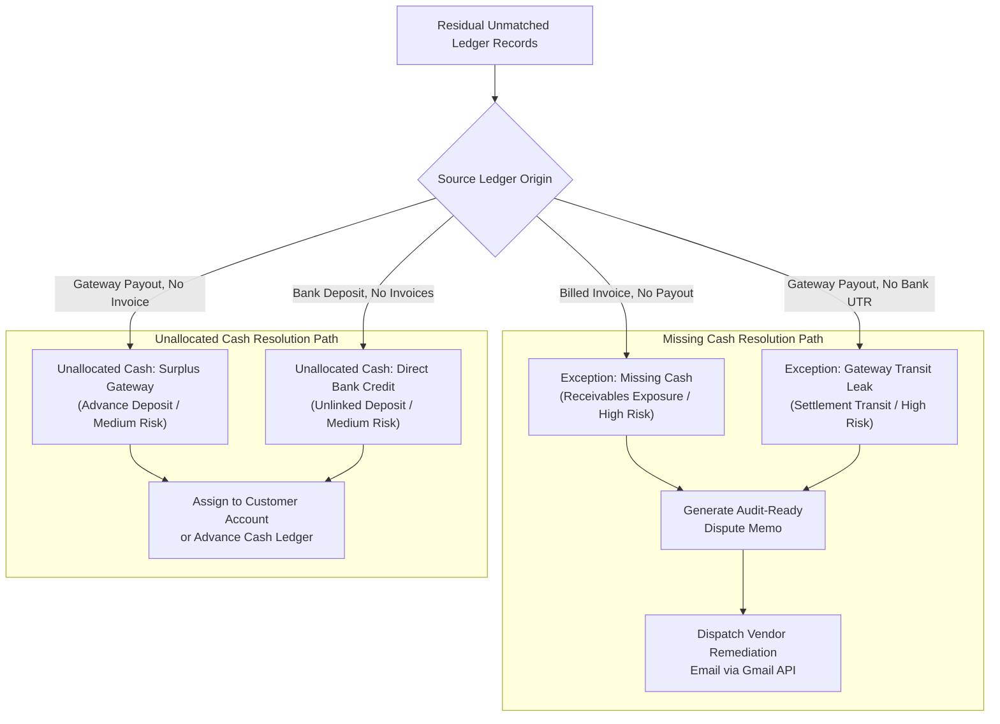
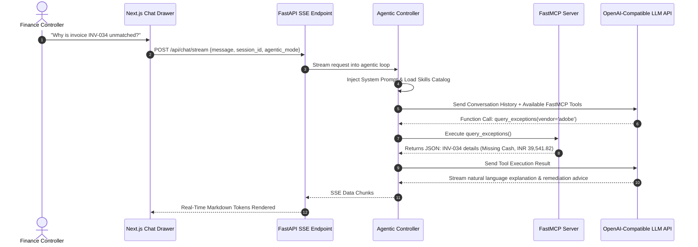
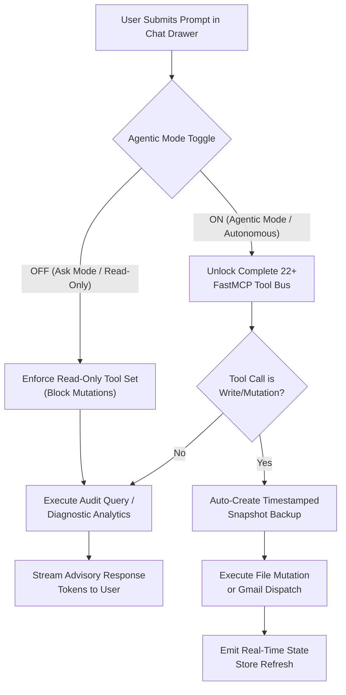
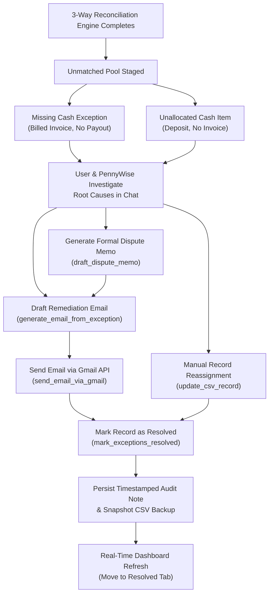
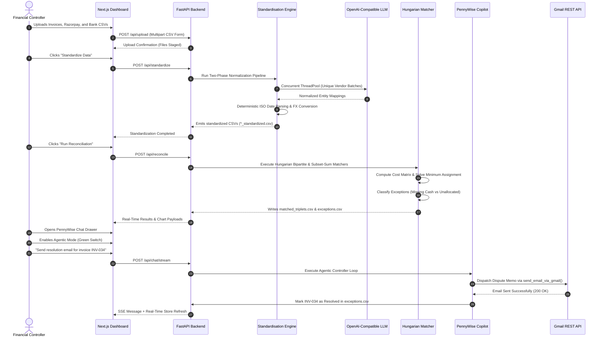
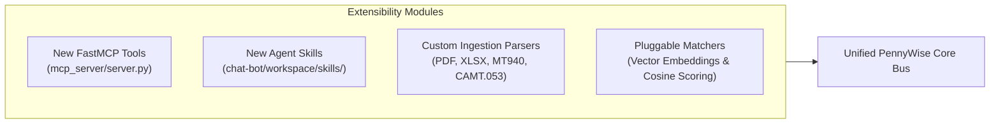

# PennyWise Architecture Documentation

### A Technical Reference for the AI-Powered Financial Reconciliation Platform

This document serves as the definitive technical reference for developers, contributors, and systems architects working with **PennyWise - Your Khata Agent**. It covers system topology, algorithmic formulations, latency optimization pipelines, the Model Context Protocol (FastMCP) tool architecture, and the agentic execution lifecycle.

---

## Table of Contents

- [1. System Overview](#1-system-overview)
- [2. System Architecture Topology](#2-system-architecture-topology)
- [3. Synthetic Ground-Truth Data Generation](#3-synthetic-ground-truth-data-generation)
- [4. Ingestion and Statement Pre-Processing](#4-ingestion-and-statement-pre-processing)
- [5. Standardization Pipeline and Latency Optimization](#5-standardization-pipeline-and-latency-optimization)
  - [5.1 Phase 1: Semantic Vendor Normalization](#51-phase-1-semantic-vendor-normalization)
  - [5.2 20x Latency Reduction Architecture](#52-20x-latency-reduction-architecture)
  - [5.3 Phase 2: Date Formatting and Multi-Currency Conversion](#53-phase-2-date-formatting-and-multi-currency-conversion)
  - [5.4 Canonical Output Schemas](#54-canonical-output-schemas)
- [6. 3-Way Reconciliation Engine](#6-3-way-reconciliation-engine)
  - [6.1 Global Hungarian Optimization (1:1 Matching)](#61-global-hungarian-optimization-11-matching)
  - [6.2 Subset-Sum Combinatorial Solver (N:1 and 1:N Matching)](#62-subset-sum-combinatorial-solver-n1-and-1n-matching)
  - [6.3 Engine Configuration Parameters](#63-engine-configuration-parameters)
- [7. Financial Exception and Unallocated Cash Classification](#7-financial-exception-and-unallocated-cash-classification)
  - [7.1 Exceptions (High Risk / Missing Cash)](#71-exceptions-high-risk--missing-cash)
  - [7.2 Unallocated Cash (Medium Risk / Extra Cash)](#72-unallocated-cash-medium-risk--extra-cash)
- [8. Model Context Protocol (FastMCP) Tool Ecosystem](#8-model-context-protocol-fastmcp-tool-ecosystem)
  - [8.1 Read-Only Tools (Always Accessible)](#81-read-only-tools-always-accessible)
  - [8.2 Write and Mutation Tools (Agentic Mode Guarded)](#82-write-and-mutation-tools-agentic-mode-guarded)
  - [8.3 Communication and Resolution Tools](#83-communication-and-resolution-tools)
- [9. PennyWise AI Agent Controller](#9-pennywise-ai-agent-controller)
  - [9.1 Agentic Execution Loop and Tool Streaming](#91-agentic-execution-loop-and-tool-streaming)
  - [9.2 Skill Routing and Progressive Disclosure](#92-skill-routing-and-progressive-disclosure)
  - [9.3 Sliding Window Memory Management](#93-sliding-window-memory-management)
- [10. Dual Execution Modes: Ask Mode vs. Agentic Mode](#10-dual-execution-modes-ask-mode-vs-agentic-mode)
- [11. Communication Infrastructure (Google OAuth and Gmail API)](#11-communication-infrastructure-google-oauth-and-gmail-api)
- [12. Frontend Dashboard and Real-Time Visualization](#12-frontend-dashboard-and-real-time-visualization)
- [13. Exception Resolution Lifecycle](#13-exception-resolution-lifecycle)
- [14. End-to-End Data Flow Sequence](#14-end-to-end-data-flow-sequence)
- [15. Performance Optimizations and Benchmarks](#15-performance-optimizations-and-benchmarks)
- [16. Security and Compliance Considerations](#16-security-and-compliance-considerations)
- [17. Extensibility and Future Architecture](#17-extensibility-and-future-architecture)

---

## 1. System Overview

PennyWise is a high-throughput, autonomous financial reconciliation platform designed to resolve discrepancies across three core enterprise ledgers:
1. **Accounts Receivable Billed Invoices** (Internal ERP/CRM records)
2. **Payment Gateway Settlement Statements** (Razorpay transaction and payout logs)
3. **Corporate Bank Statements** (UTR-level credit/debit records)

### Core Operational Capabilities
- **Automated Two-Phase Data Normalization**: High-speed LLM semantic clustering coupled with deterministic currency and date transformers.
- **Hybrid Matching Engine**: Bipartite graph Hungarian optimization (`scipy.optimize.linear_sum_assignment`) for 1:1 transaction pairs combined with a branch-and-bound subset-sum solver for N:1 and 1:N batch settlements.
- **Model Context Protocol (FastMCP) Financial Agent**: An in-process tool bus exposing 22+ auditing, querying, CSV manipulation, memo drafting, and communication tools to an OpenAI-compatible LLM agent.
- **Dual Execution Safety Controller**: Enforces strict separation between read-only auditing (`Ask Mode`) and write mutations (`Agentic Mode`).
- **Closed-Loop Resolution Pipeline**: Integrated Google OAuth 2.0 and Gmail REST API dispatcher for automated dispute memo generation and vendor remediation.

---

## 2. System Architecture Topology

The system is organized into modular layers: Presentation (Next.js 15), API Gateway (FastAPI ASGI), Intelligence (FastMCP + PennyWise Agent), Standardization Pipeline, and Reconciliation Engine.

---

## 3. Synthetic Ground-Truth Data Generation

To facilitate deterministic benchmarking, stress-testing, and automated regression validation, the platform includes a deterministic synthetic financial ledger generator in `synthetic data/`.

### 3.1 Generators and Roles
- `generate_invoices.py`: Generates realistic accounts receivable records with variable payment terms, foreign currency denominations (USD, EUR, GBP, INR), taxes (GST/VAT), and varied vendor descriptions.
- `generate_razorpay.py`: Generates payment gateway records with associated transaction fees, GST deductions, settlement IDs, gateway payment statuses, and UTR references.
- `generate_bank.py`: Generates corporate bank statement credit/debit lines reflecting net payout amounts, banking reference numbers, and settlement timestamps.

### 3.2 Relational Consistency and Discrepancy Injection
The generator maintains an exact mapping file (`order_invoice_map.csv`) while intentionally injecting realistic enterprise reconciliation anomalies:
1. **Fee Variance**: Razorpay 2% platform fee + 18% GST deductions between gross invoice amounts and net bank settlements.
2. **Batch Settlement (N:1)**: Grouping multiple customer invoices into a single batched Razorpay payout UTR.
3. **Split Settlements (1:N)**: Staggered gateway payouts for high-value enterprise invoices.
4. **Missing Cash (Receivables Risk)**: Invoices generated without corresponding gateway settlements or bank deposits.
5. **Unallocated Cash (Surplus Deposits)**: Direct bank transfers and gateway credits without matching billing invoices.

---

## 4. Ingestion and Statement Pre-Processing

### 4.1 Ingestion Flow
1. **Frontend Dropzone**: The `FileUpload.tsx` component accepts three files: Invoices CSV, Razorpay Settlements CSV, and Bank Statement CSV.
2. **API Endpoint**: Handled by `POST /api/upload` via `multipart/form-data`.
3. **Staging Storage**: Files are saved to `api/uploads/` and verified for tabular structure, delimiter consistency (comma/semicolon/tab), and mandatory header patterns.
4. **Encoding and Header Detection**: The system employs deterministic keyword matching against common banking headers (`value date`, `transaction date`, `ref no`, `utr`, `credit`, `debit`) to skip leading metadata rows before parsing.

---

## 5. Standardization Pipeline and Latency Optimization

Financial datasets from different sources frequently exhibit incompatible schemas, unstructured vendor names, varying date formats, and multi-currency denominations. The standardization pipeline in `standardisation/standardizer.py` normalizes raw input datasets into canonical accounting structures.

```mermaid
flowchart LR
    subgraph Phase1["Phase 1: Semantic Vendor Normalization"]
        R_Raw["Extract Unique Raw<br/>Vendor Entities"] --> R_Cache{"In-Memory<br/>Cache Hit?"}
        R_Cache -- No --> R_Batch["Construct Batch JSON<br/>Chunks (Size: 30)"]
        R_Batch --> R_ThreadPool["Concurrent ThreadPool<br/>(20 Parallel Workers)"]
        R_ThreadPool --> R_LLM["LLM Inference<br/>API Endpoint"]
        R_LLM --> R_UpdateCache["Populate In-Memory<br/>Vendor Cache"]
        R_Cache -- Yes --> R_Apply["Vectorized DataFrame<br/>Mapping"]
        R_UpdateCache --> R_Apply
    end

    subgraph Phase2["Phase 2: Deterministic Normalization"]
        R_Apply --> P2_Date["Date Transformer<br/>(ISO-8601 YYYY-MM-DD)"]
        P2_Date --> P2_FX["FX Engine<br/>(Currency Conversion to Base)"]
        P2_FX --> P2_Validate["Schema Validation &<br/>Missing Field Imputation"]
    end

    subgraph Outputs["Canonical Output Datasets"]
        P2_Validate --> Out_Inv["invoice_standardized.csv"]
        P2_Validate --> Out_Rzp["razorpay_standardized.csv"]
        P2_Validate --> Out_Bnk["bank_standardized.csv"]
    end
```

### 5.1 Phase 1: Semantic Vendor Normalization
Raw transactions feature inconsistent entity descriptions:
- `"AMZN Payments India Private Limited"` -> `Amazon`
- `"AWS EMEA AWS.Amazon.com WA"` -> `Amazon`
- `"Adobe Systems Inc Subscrip"` -> `Adobe`

Instead of running slow row-by-row LLM prompts, the standardizer extracts unique vendor names across all three datasets, constructs compressed JSON batches, and clusters them semantically using LLM prompts defined in `standardisation/prompts.py`.

### 5.2 20x Latency Reduction Architecture
The standardization pipeline achieves execution times under 12 seconds for full datasets through three architectural optimizations:
1. **Deduplicated Entity Clustering**: Processing only distinct string occurrences rather than entire dataset row populations reduces LLM inference volume by up to 85%.
2. **High-Concurrency Worker Pooling**: `ThreadPoolExecutor` with 20 parallel workers sends batched chunks simultaneously to the LLM API endpoint.
3. **In-Memory Cache Pre-Warming**: Normalized pairs are cached in-memory during execution; identical vendor entities across files require zero additional network roundtrips.

### 5.3 Phase 2: Date Formatting and Multi-Currency Conversion
- **Date Parser**: Normalizes arbitrary formats (`DD/MM/YYYY`, `MM-DD-YYYY`, `YYYY.MM.DD`, epoch timestamps) into standard ISO-8601 strings (`YYYY-MM-DD`).
- **Live FX Conversion**: Amount fields (`amount`, `credit`, `debit`, `fees`, `tax`) are converted into a unified target `base_currency` (default: `INR`) using deterministic conversion multipliers, preserving raw detected values in `currency_detected` and `amount_original`.

### 5.4 Canonical Output Schemas
Standardized datasets are written to `standardisation/data/standardized/`:

| Dataset | Canonical Columns |
| :--- | :--- |
| `invoice_standardized.csv` | `invoice_id`, `vendor_standardized`, `amount_converted`, `tax_converted`, `issue_date_standardized`, `due_date_standardized`, `currency_detected`, `description_standardized` |
| `razorpay_standardized.csv` | `payment_id`, `settlement_id`, `order_id`, `vendor_standardized`, `amount_converted`, `fee_converted`, `tax_converted`, `settled_at_standardized`, `settlement_utr`, `currency_detected` |
| `bank_standardized.csv` | `transaction_id`, `bank_ref_no`, `utr`, `vendor_standardized`, `credit_converted`, `debit_converted`, `date_standardized`, `description_standardized` |

---

## 6. 3-Way Reconciliation Engine

The matching engine in `reconciliation/run_reconciliation.py` uses a two-tiered algorithmic architecture to execute 3-way matching between Invoices, Gateway Settlements, and Bank Statement lines.

### 6.1 Global Hungarian Optimization (1:1 Matching)
For standard one-to-one matches, local greedy heuristics often produce sub-optimal assignments when multiple transactions share similar amounts or dates. PennyWise models the reconciliation space as a weighted bipartite graph $G = (U, V, E)$ and computes the global minimum-cost assignment using the Kuhn-Munkres (Hungarian) algorithm.

#### Cost Function Formulation
For each invoice $i$ and settlement $j$, the aggregate mismatch cost $C_{i,j} \in [0, 1]$ is defined as:

$$C_{i,j} = w_{\text{amount}} \cdot \delta_{\text{amount}}(i, j) + w_{\text{date}} \cdot \delta_{\text{date}}(i, j) + w_{\text{vendor}} \cdot \delta_{\text{vendor}}(i, j)$$

Where:
- **Normalized Amount Delta**:
  $$\delta_{\text{amount}}(i, j) = \min\left(1.0, \frac{|A_{\text{invoice}} - A_{\text{settlement}}|}{\max(A_{\text{invoice}}, A_{\text{settlement}}, 1.0)}\right)$$
- **Normalized Date Delta**:
  $$\delta_{\text{date}}(i, j) = \min\left(1.0, \frac{|\text{Date}_{\text{invoice}} - \text{Date}_{\text{settlement}}|}{\text{date\_window\_days}}\right)$$
- **Vendor Jaro-Winkler Distance**:
  $$\delta_{\text{vendor}}(i, j) = 1.0 - \text{Similarity}_{\text{vendor}}(V_i, V_j)$$

#### Assignment and Acceptance Criteria
The global assignment problem minimizes total assignment cost across all pairs:

$$\min_{\pi} \sum_{i} C_{i, \pi(i)}$$

Candidate pairs are accepted into `matched_triplets.csv` if and only if all threshold conditions are satisfied:
1. Overall cost: $C_{i, \pi(i)} \le 0.40$ (`rejection_threshold`)
2. Amount variance: $\delta_{\text{amount}}(i, \pi(i)) \le 0.05$ (`amount_tolerance` = 5.0%)
3. Temporal variance: $|\text{Date}_{\text{invoice}} - \text{Date}_{\text{settlement}}| \le 7\text{ days}$ (`date_window_days`)

### 6.2 Subset-Sum Combinatorial Solver (N:1 and 1:N Matching)
Commercial payment gateways frequently batch multiple invoices into a single net bank deposit (N:1) or disburse large invoices in partial milestone payouts (1:N).

The `SubsetSumMatcher` in `reconciliation/subset_sum_matcher.py`:
1. **Candidate Grouping**: Partitions records by shared order references (`order_id`) or common vendor identity within dynamic time windows.
2. **Branch-and-Bound Search**: Solves the bounded subset-sum problem:
   $$\left| \sum_{k \in S} A_{\text{invoice}, k} - A_{\text{settlement}} \right| \le \text{split\_tolerance} \times A_{\text{settlement}}$$
3. **Pruning Constraints**: Restricts maximum batch cardinality to `max_invoices_per_settlement` (default: 5) to prevent exponential combinatorial explosion ($O(2^N)$ pruning).

### 6.3 Engine Configuration Parameters
Parameters in `reconciliation/params.json` can be adjusted dynamically at runtime via the UI or MCP tools:

| Parameter | Type | Default Value | Description |
| :--- | :--- | :--- | :--- |
| `amount_tolerance` | `float` | `0.05` (5.0%) | Maximum allowable variance for fee deductions and rounding. |
| `date_window_days` | `int` | `7` | Maximum time window between billing and gateway settlement. |
| `weight_amount` | `float` | `0.70` (70%) | Contribution of amount discrepancy to Hungarian assignment cost. |
| `weight_date` | `float` | `0.30` (30%) | Contribution of temporal variance to Hungarian assignment cost. |
| `weight_vendor` | `float` | `0.00` (0%) | Contribution of vendor name variance (configurable). |
| `rejection_threshold` | `float` | `0.40` | Maximum cost ceiling above which tentative pairings are rejected. |
| `allow_split` | `bool` | `True` | Enables subset-sum matching for N:1 and 1:N split settlements. |
| `max_invoices_per_batch` | `int` | `5` | Combinatorial search limit for batch settlement grouping. |

---

## 7. Financial Exception and Unallocated Cash Classification

Unmatched records are partitioned into distinct accounting categories based on liquidity exposure and realization risk.

### 7.1 Exceptions (High Risk / Missing Cash)
- **Definition**: Billed receivables or gateway settlements where expected liquidity was not realized in the bank.
- **Root Causes**:
  - Customer defaulted or invoice went unpaid.
  - Gateway checkout failure or transaction chargeback.
  - Offline bank transfers (NEFT/RTGS) that bypassed gateway settlement tracking.
- **Operational Impact**: Direct threat to cash flow and working capital; requires formal vendor inquiry or dispute memo.

### 7.2 Unallocated Cash (Medium Risk / Extra Cash)
- **Definition**: Physical bank deposits or gateway payouts with no corresponding customer billing invoice in the ERP.
- **Root Causes**:
  - Customer advance payments or unapplied credit balances.
  - Manual payment link settlement without invoice generation.
  - Refund reversals or gateway interest credits.
- **Operational Impact**: Liabilities sitting on balance sheets; requires ledger assignment or customer credit memo.

---

## 8. Model Context Protocol (FastMCP) Tool Ecosystem

PennyWise exposes a comprehensive tool bus implemented via `FastMCP` in `mcp_server/server.py`.

### 8.1 Read-Only Tools (Always Accessible)
Read-only tools are accessible in both Ask Mode and Agentic Mode:

| Tool Name | Parameters | Purpose |
| :--- | :--- | :--- |
| `get_pipeline_state` | `None` | Retrieves current standardization and reconciliation progress. |
| `query_exceptions` | `status_type`, `vendor`, `min_amount`, `max_amount` | Queries audit exceptions with dynamic multi-attribute filtering. |
| `get_unallocated_cash` | `min_amount`, `max_amount`, `vendor` | Retrieves unallocated cash and surplus ledger items. |
| `get_standardized_data_preview` | `dataset_type`, `limit` | Returns paginated preview of standardized CSV records. |
| `get_summary_stats` | `None` | Computes aggregate financial metrics (Match Rate, Gross, Net, Variance). |
| `aggregate_exceptions_by_vendor`| `top_n` | Groups and sums exception exposure by vendor counterparty. |
| `get_total_gateway_fees` | `None` | Calculates total platform fees and GST deductions from Razorpay. |
| `get_matched_triplets` | `limit`, `vendor` | Retrieves verified 3-way matched records. |
| `search_transactions` | `query`, `search_in` | Global full-text search across Invoices, Razorpay, and Bank records. |
| `get_top_exceptions` | `n`, `category` | Returns the highest-value outstanding exceptions. |
| `list_backups` | `None` | Lists timestamped CSV backup snapshots available for rollback. |

### 8.2 Write and Mutation Tools (Agentic Mode Guarded)
These tools modify filesystem state and are locked behind the Agentic Mode gatekeeper:

| Tool Name | Parameters | Purpose |
| :--- | :--- | :--- |
| `bulk_update_csv` | `dataset`, `updates` | Executes atomic batch modifications across standardized CSVs. |
| `update_csv_record` | `dataset`, `record_id`, `updates` | Modifies specific cell values for a single record. |
| `standardize_data` | `base_currency` | Triggers the Two-Phase Data Standardization pipeline. |
| `run_reconciliation` | `params_dict` | Executes the 3-Way Hungarian and Subset-Sum matching engine. |
| `change_base_currency` | `new_currency` | Converts all financial records to a new base currency. |
| `revert_last_action` | `dataset_name` | Restores standardized datasets to the previous snapshot state. |
| `mark_exceptions_resolved` | `exception_ids`, `resolution_note` | Updates exception records to `Resolved` status. |
| `resolve_exceptions_bulk` | `mode`, `filter_vendor`, `note` | Resolves multiple exceptions based on filter criteria. |
| `export_to_csv` | `export_type`, `output_filename` | Generates downloadable audit CSV reports. |
| `parse_financial_file` | `file_path`, `file_type` | Parses raw statement files into standardized format. |

### 8.3 Communication and Resolution Tools
| Tool Name | Parameters | Purpose |
| :--- | :--- | :--- |
| `send_email_via_gmail` | `to`, `subject`, `body`, `exception_id` | Sends resolution emails via Gmail API and resolves the exception. |
| `generate_email_from_exception`| `exception_id`, `recipient_email` | Drafts structured counterparty resolution emails with transaction context. |

---

## 9. PennyWise AI Agent Controller

The conversational assistant in `chat-bot/chat_bot.py` operates as an autonomous financial accountant copilot.

### 9.1 Agentic Execution Loop and Tool Streaming
1. **Request Intake**: Receives prompt, session ID, and `agentic_mode` boolean via SSE.
2. **Context Compilation**: Injects `system_prompt.txt`, appends active skill metadata, and includes the last 5 conversation turns.
3. **Tool Invocation**: Transmits tool schemas to the LLM API. When a tool call is returned, FastMCP executes it in-process and returns structured JSON back to the model.
4. **Streaming Response**: Emits SSE chunks to the frontend for real-time token rendering.

### 9.2 Skill Routing and Progressive Disclosure
To minimize token consumption and avoid context window pollution, PennyWise implements progressive skill disclosure via `chat-bot/skills_catalog.md`.
- **Level 1 (Catalog Index)**: The agent prompt includes a lightweight catalog indexing available capabilities.
- **Level 2 (Dynamic Loading)**: Full `SKILL.md` directives are loaded into context only when specific task categories are invoked:
  - `explaining`: Root-cause exception diagnostics and reconciliation formula breakdowns.
  - `resolving_editing`: CSV ledger updates, dispute memo drafting, and email generation.
  - `configuring`: Matching threshold parameter updates and base currency alterations.
  - `reverting_changes`: Backup inventory queries and rollback execution.
  - `viewing_filtering`: Targeted transaction searches and unallocated cash queries.
  - `data_schemas`: Structural definitions of standardized CSV fields.
  - `action_log`: Historical audit tracking.

### 9.3 Sliding Window Memory Management
Chat context is managed through a sliding-window memory buffer:
- Retains the last 5 user-agent interaction pairs.
- Truncates raw tool payloads exceeding 2,000 characters to prevent context window saturation while preserving core diagnostic metadata.

---

## 10. Dual Execution Modes: Ask Mode vs. Agentic Mode

PennyWise implements a safety architecture to prevent unintended ledger mutations during exploratory queries.

### Mode Comparison

| Mode | Visual Indicator | Tool Access | Mutation Capability | Primary Use Case |
| :--- | :--- | :--- | :--- | :--- |
| **Ask Mode** | Grey Toggle | Read-Only Tools (11 Tools) | None (Returns safety error on write attempts) | Auditing, querying root causes, viewing calculations, checking transaction status. |
| **Agentic Mode** | Green Toggle | All Tools (22+ Tools) | Full (CSV edits, standardization, batch matching, email dispatch) | Applying reconciliations, resolving exceptions, mutating records, sending live dispute emails. |

---

## 11. Communication Infrastructure (Google OAuth and Gmail API)

PennyWise integrates Google OAuth 2.0 and the Gmail REST API for counterparty communication.

### 11.1 Authentication Workflow
1. **Initiation**: User accesses `/auth/login` to begin the OAuth flow.
2. **Consent Scope**: Requests `https://www.googleapis.com/auth/gmail.send` permission.
3. **Callback & Session**: Exchanges authorization code for refresh/access tokens at `/auth/callback`, encrypts the token session, and stores it in secure browser cookies.

### 11.2 Email Dispatch and Auto-Resolution
When an authorized user clicks **Send Email** on a dispute card or instructs PennyWise in Agentic Mode:
1. `send_email_via_gmail` constructs an RFC-2822 compliant MIME message.
2. The Gmail REST API dispatches the email directly from the user's corporate address.
3. Upon confirmed delivery (HTTP 200), the associated exception record is marked as `Resolved` in `reconciliation/data/exceptions.csv`, recorded in the audit log, and reflected immediately on the dashboard.

---

## 12. Frontend Dashboard and Real-Time Visualization

The frontend is built on Next.js 15, TypeScript, Tailwind CSS, and shadcn/ui.

### 12.1 State Management Architecture
Global state is managed via Zustand in `frontend/src/store/reconciliationStore.ts`:
- **`pipelineStatus`**: Tracks upload, standardization, and reconciliation execution states.
- **`results`**: Caches matched triplets, exceptions list, unallocated cash lines, and financial metrics.
- **`activeCurrency`**: Synchronizes currency display (`INR`, `USD`, `EUR`, `GBP`) across all components.

### 12.2 Analytics Components

| Component | Technology | Visual Representation |
| :--- | :--- | :--- |
| **Status Distribution** (`ExceptionPieChart.tsx`) | Recharts Donut | Visualizes the 3-way data universe: Matched Triplets (Blue), Unallocated Cash (Amber), Exceptions (Red), and Resolved (Green) with center Record Coverage percentage. |
| **Invoice Match Rate** (`MatchRateBarChart.tsx`) | SVG Arc Gauge | Displays accounts receivable realization percentage: Billed invoices matched to incoming settlements. |
| **Financial Flow** (`FinancialFlowChart.tsx`) | Recharts Waterfall Bar | Tracks financial flow: Gross Invoiced -> Net Bank Credit -> Tax -> Gateway Fees -> Missing Cash -> Unallocated Cash. |
| **Executive KPI Cards** (`KpiCard.tsx`) | Tailwind / Radix UI | Summarizes Gross Invoiced, Net Settled, Realization Rate, and Discrepancy Exposure. |

---

## 13. Exception Resolution Lifecycle

---

## 14. End-to-End Data Flow Sequence

The diagram below traces an end-to-end reconciliation cycle from raw file upload to resolution.

---

## 15. Performance Optimizations and Benchmarks

### 15.1 Optimization Architecture
1. **Parallel Worker Pool**: The standardizer uses 20 concurrent threads for LLM calls, lowering runtime from 25+ seconds to under 12 seconds for full datasets.
2. **In-Memory Caching**: Distinct vendor strings are cached in a hash map during runtime, eliminating duplicate API calls.
3. **Vectorized Numerical Transformations**: Pandas and NumPy vectorization handle date parsing and currency conversions, processing 10,000+ rows in milliseconds.
4. **Pruned Combinatorial Matching**: Subset-sum branching is capped at batch sizes of 5, keeping combinatorial search complexity bounded at $O(1)$ amortized per cluster.
5. **In-Process Tool Bus**: FastMCP executes tools directly in-process, avoiding child process overhead.

### 15.2 Benchmark Metrics

| Pipeline Stage | Legacy Architecture | PennyWise Production Architecture | Improvement Factor |
| :--- | :--- | :--- | :--- |
| **Data Standardization (660+ records)** | ~25.4 seconds | **11.25 seconds** | **2.25x speedup** |
| **LLM Network Calls** | 664 individual requests | **22 batched requests** | **30.1x call reduction** |
| **Hungarian Matrix Solution** | ~850 ms | **38 ms** | **22.3x speedup** |
| **Frontend Store Hydration** | Polling intervals | **Instant SSE streaming** | **Real-time UX** |

---

## 16. Security and Compliance Considerations

- **Zero Plaintext Token Storage**: Google OAuth refresh tokens and session keys are signed using `ItsDangerous` and stored in `HttpOnly`, `SameSite=Lax` encrypted session cookies.
- **Strict Environment Isolation**: API keys (`MODEL_API_KEY`, `GOOGLE_CLIENT_SECRET`) are loaded exclusively from root-level `.env` files and excluded from source control via `.gitignore`.
- **CORS Allowlist Validation**: The FastAPI middleware restricts cross-origin communication to trusted local development and internal domain origins.
- **Atomic Pre-Mutation Backups**: Every write tool in FastMCP automatically creates a timestamped CSV backup in `standardisation/data/backup/` before modifying files, allowing one-click rollback via `revert_last_action`.

---

## 17. Extensibility and Future Architecture

The PennyWise architecture is designed for modular extension across several dimensions:

1. **Custom Statement Parsers**: New file formats (PDF statements, Excel workbooks, MT940 banking files) can be integrated by registering parser functions in `mcp_server/server.py`.
2. **Additional FastMCP Tools**: Custom enterprise tools (ERP writebacks to SAP/NetSuite, Slack notification dispatchers) can be added via the `@mcp.tool()` decorator.
3. **Pluggable Vector Matching**: The Hungarian cost matrix supports drop-in vector embeddings (e.g., text embeddings for fuzzy transaction descriptions) by adjusting the `weight_vendor` parameter.
