<div align="center">

# PennyWise — Your Khata Agent
### AI-Powered 3-Way Financial Reconciliation for Modern Finance Teams

[](LICENSE)
[](https://www.python.org/)
[](https://nextjs.org/)
[](https://github.com/jlowin/fastmcp)
[](https://github.com/harissh-k06/Razorpay_Buildathon)

<p align="center">
  <a href="#key-features">Key Features</a> •
  <a href="#architecture-at-a-glance">Architecture</a> •
  <a href="#technology-stack">Tech Stack</a> •
  <a href="#quick-start">Quick Start</a> •
  <a href="#usage-examples">Usage Examples</a> •
  <a href="#screenshots">Screenshots</a> •
  <a href="#documentation">Docs</a>
</p>

</div>

---

## Introduction

Financial reconciliation is traditionally a manual, stressful, and error-prone grind. High-velocity businesses struggle with disparate statement formats, multi-currency conversions, gateway fee deductions, batch settlements, and timing delays between billing invoices, payment gateway records, and bank deposits. Unreconciled accounts lead to delayed financial closes, cash leakage, and audit headaches.

**PennyWise** transforms reconciliation from a tedious chore into an autonomous, intelligent experience. By pairing a high-throughput data standardization pipeline with bipartite Hungarian optimization and subset-sum matching algorithms, PennyWise solves 1:1, N:1, and 1:N transaction realization with mathematical precision.

Equipped with **PennyWise AI**—an interactive financial audit assistant powered by the Model Context Protocol (FastMCP)—finance teams can query audit exceptions in natural language, draft audit-ready dispute memos, and dispatch counterparty resolution emails with zero friction.

---

## Key Features

| Feature | Description |
| :--- | :--- |
| **3-Way Reconciliation** | Global bipartite Hungarian optimization + Subset-sum solvers for 1:1, N:1 batched payouts, and 1:N split settlements. |
| **PennyWise AI Assistant** | Conversational financial copilot to query exceptions, investigate discrepancies, and analyze settlements. |
| **Agentic Mode Switch** | UI toggle between **Ask Mode** (read-only advisory) and **Agentic Mode** (autonomous write & dispatch execution). |
| **Email Resolution** | One-click generation and dispatch of vendor resolution and dispute emails via Google OAuth & Gmail API. |
| **Interactive Dashboard** | Next.js 15 & Tailwind dashboard with waterfall realization charts, coverage donuts, and realization gauges. |
| **Exception Management** | Automated categorization of **Missing Cash** (High Risk) vs. **Unallocated Cash** (Extra Cash) with resolution workflows. |
| **Data Standardisation** | High-throughput parallel LLM normalization for semantic vendor naming, unified date parsing, and live FX conversion. |
| **Immutable Audit Trail** | Timestamped snapshot backups and full historic audit logs for reversible ledger modifications. |

---

## Architecture at a Glance

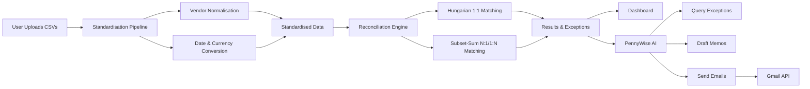

> For an in-depth breakdown of algorithms, mathematical formulations, and MCP tool schemas, see [ARCHITECTURE.md](ARCHITECTURE.md).

---

## Technology Stack

| Layer | Technologies |
| :--- | :--- |
| **Backend API** | FastAPI, Python 3.10+, Uvicorn (ASGI) |
| **Frontend Web App** | Next.js 15 (App Router), TypeScript, Tailwind CSS |
| **UI Components & Charts** | Radix UI, shadcn/ui, Lucide Icons, Recharts |
| **State Management** | Zustand |
| **Reconciliation Engine** | NumPy, Pandas, SciPy (`linear_sum_assignment`), Combinatorial Solvers |
| **Agent & Tools** | FastMCP (Model Context Protocol), OpenAI-Compatible LLM API |
| **Auth & Communications** | Google OAuth 2.0, Gmail REST API, ItsDangerous |

---

## Quick Start

### 1. Clone & Configure Environment

```bash
# Clone the repository
git clone https://github.com/harissh-k06/Razorpay_Buildathon.git
cd Razorpay-2

# Copy the environment configuration template
cp .env.example .env
```

Open `.env` and provide your OpenAI-compatible LLM API Key:
```env
MODEL_API_KEY="your_api_key_here"
```

### 2. Backend Setup

```bash
# Create and activate virtual environment
python -m venv venv
source venv/bin/activate  # Windows: venv\Scripts\activate

# Install all backend dependencies
pip install -r requirements.txt

# Start FastAPI backend
uvicorn api.main:app --port 8000 --reload
```

### 3. Frontend Setup

In a new terminal:
```bash
cd frontend
npm install
npm run dev
```

Visit [http://localhost:3000](http://localhost:3000) in your browser.

> For complete setup and troubleshooting details, see [QUICKSTART.md](QUICKSTART.md).

---

## Usage Examples

### 1. Investigating Unmatched Transactions
```text
User: "Why is invoice INV-034 not matched?"

PennyWise: "INV-034 for ₹39,541.82 (Adobe) is currently unmatched because no matching 
settlement was received from the payment gateway. 

Audit Details:
- Issue Date: 2026-03-02 | Due Date: 2026-04-01
- Gross Amount: ₹39,541.82
- Category: High Risk (Missing Cash / Unsettled Receivables)

Potential Root Causes:
1. Payout settlement is pending from the gateway
2. Transaction was processed offline via direct NEFT/RTGS
3. Payment failed at gateway checkout"
```

### 2. Drafting Dispute & Clarification Memos
```text
User: "Draft a dispute memo for INV-034"

PennyWise: [Generates a formal, audit-ready dispute memo containing transaction references, 
counterparty information, outstanding variance, and required remediation steps.]
```

### 3. Dispatching Counterparty Resolution Emails
```text
User: "Send this memo to billing@adobe.com"

PennyWise: "Resolution email drafted and dispatched via Gmail API to billing@adobe.com. 
Exception record INV-034 has been marked as Resolved in the audit log."
```

---

## Screenshots

### 1. Ingestion & Raw Statement Files

| Statement Upload Interface | Raw Invoices Statement (CSV) |
|:---:|:---:|
| 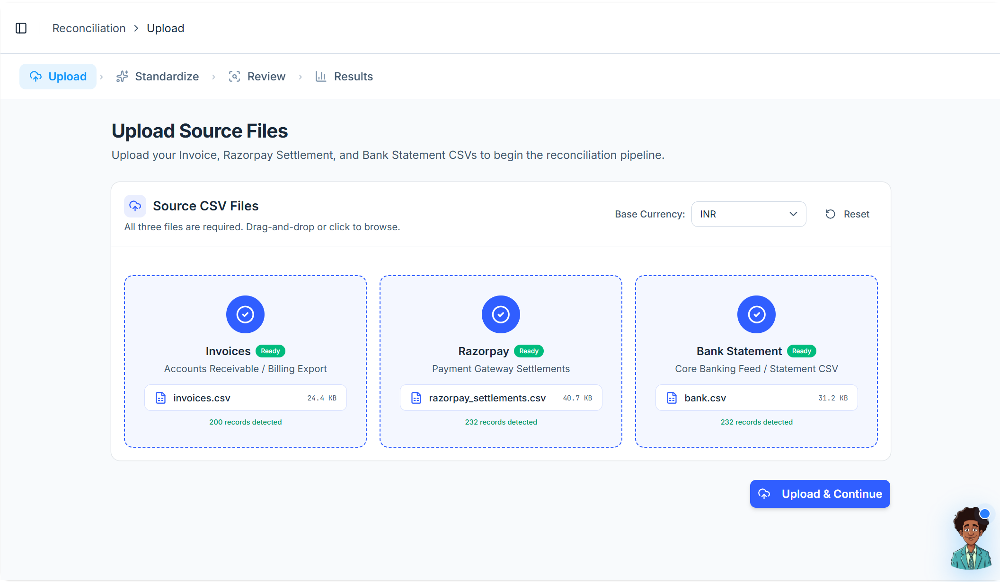 | 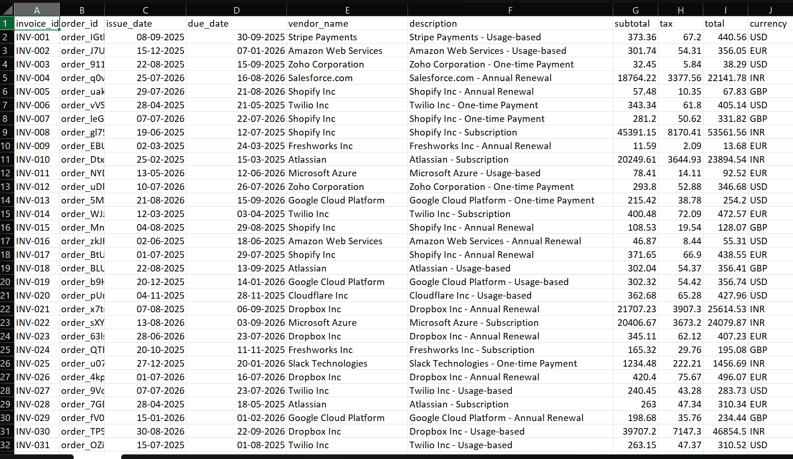 |

| Raw Razorpay Settlements (CSV) | Raw Bank Statement (CSV) |
|:---:|:---:|
| 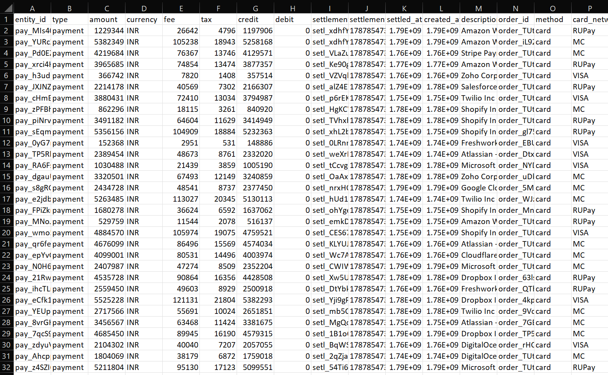 | 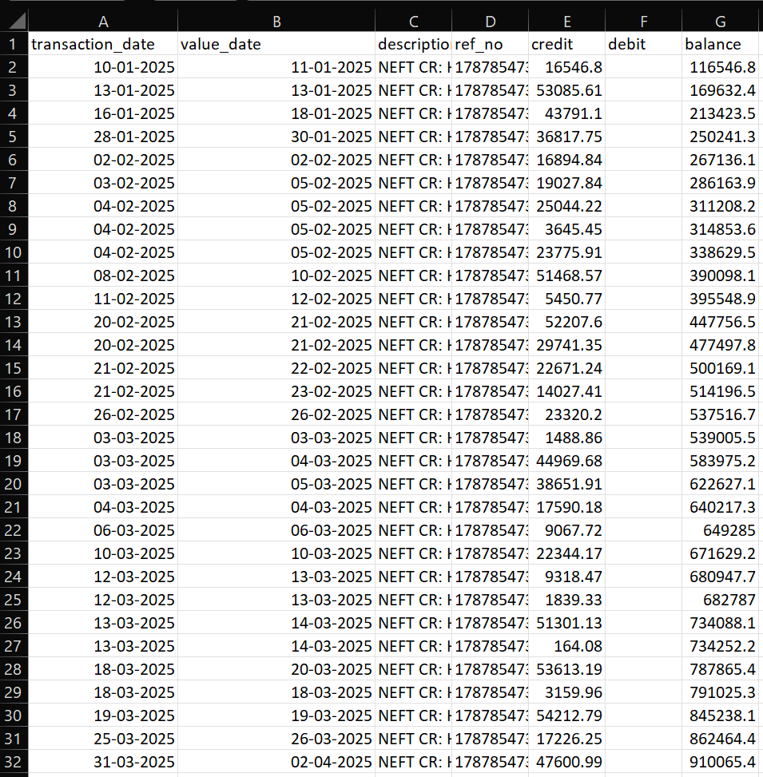 |

### 2. Standardization & 3-Way Review

| Data Standardisation Pipeline | 3-Way Dataset Review & Editing |
|:---:|:---:|
| 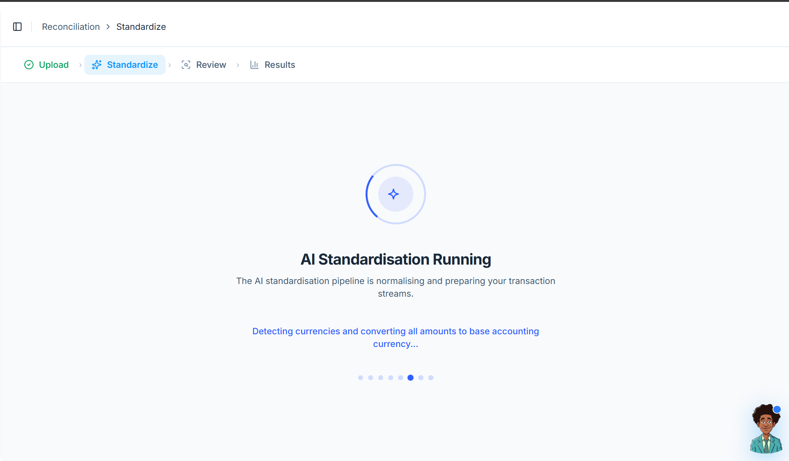 | 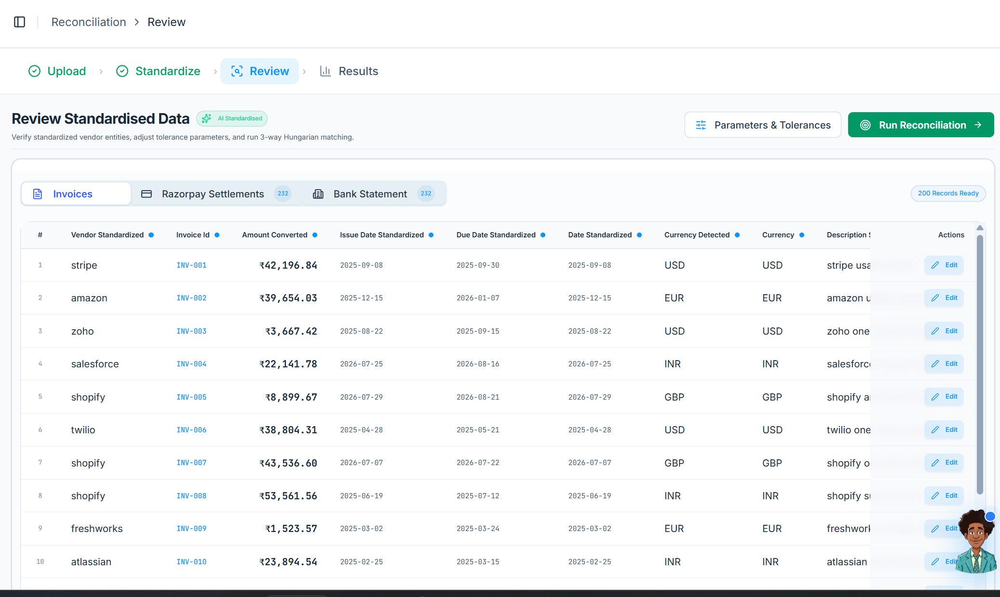 |

### 3. Executive Analytics & Visualizations

| Executive KPI Cards | Reconciliation Results Dashboard |
|:---:|:---:|
| 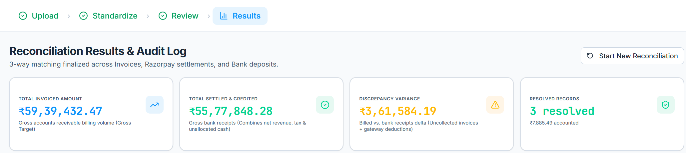 | 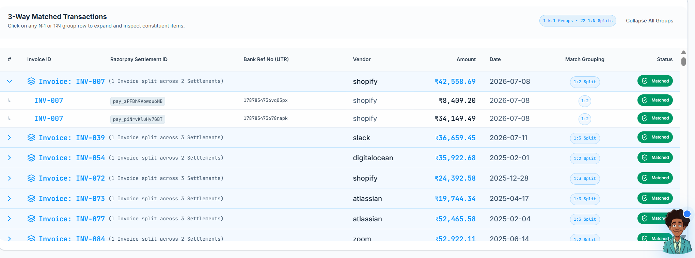 |

| Status Distribution Donut Chart | Invoice Match Realization Gauge | Financial Flow Waterfall Realization |
|:---:|:---:|:---:|
| 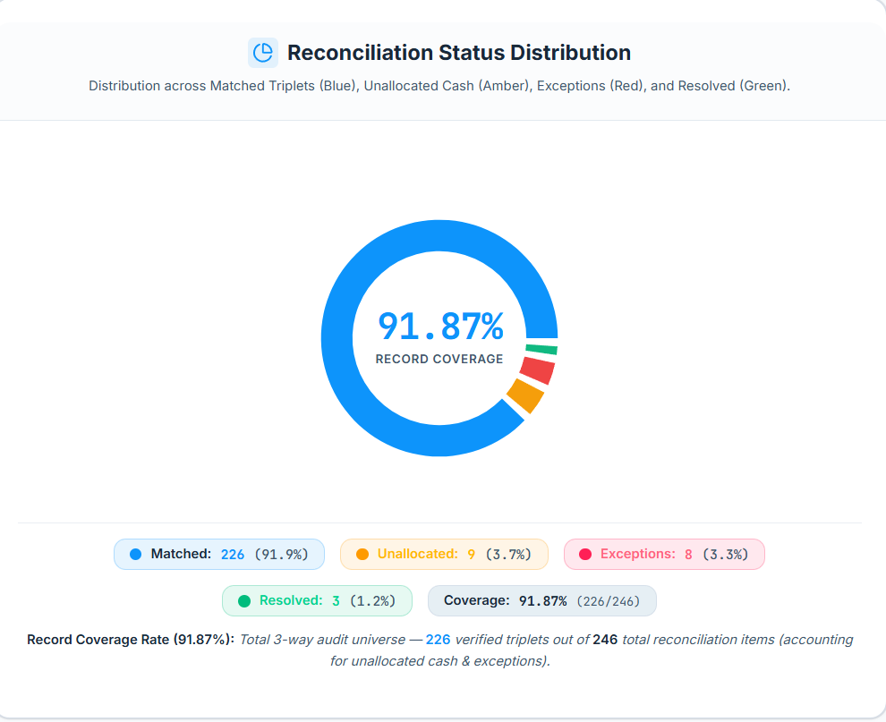 | 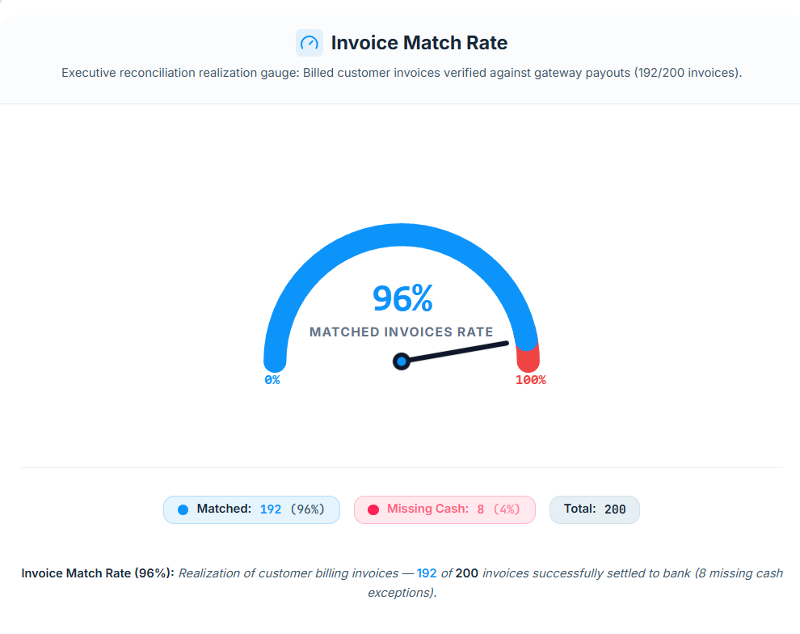 | 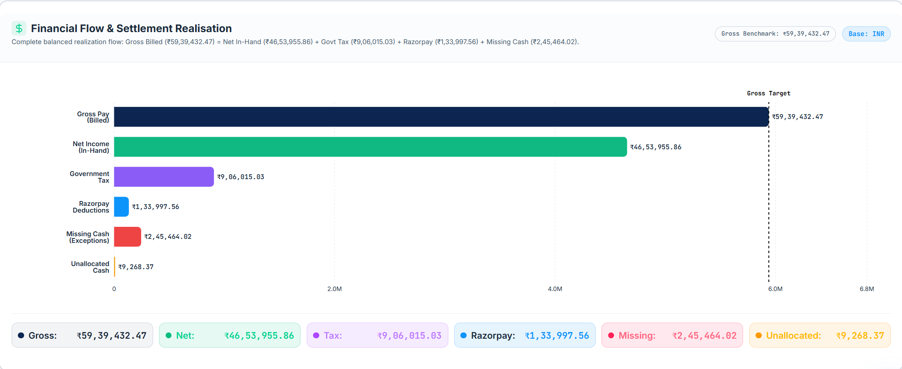 |

### 4. PennyWise AI Copilot & Resolution Workflows

| AI Data Audit (Review Page) | AI Dispute Memos (Results Page) |
|:---:|:---:|
| 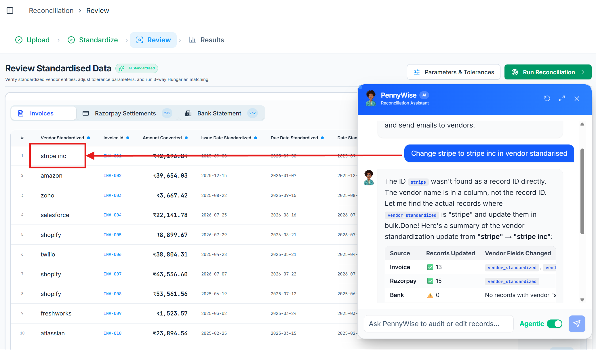 | 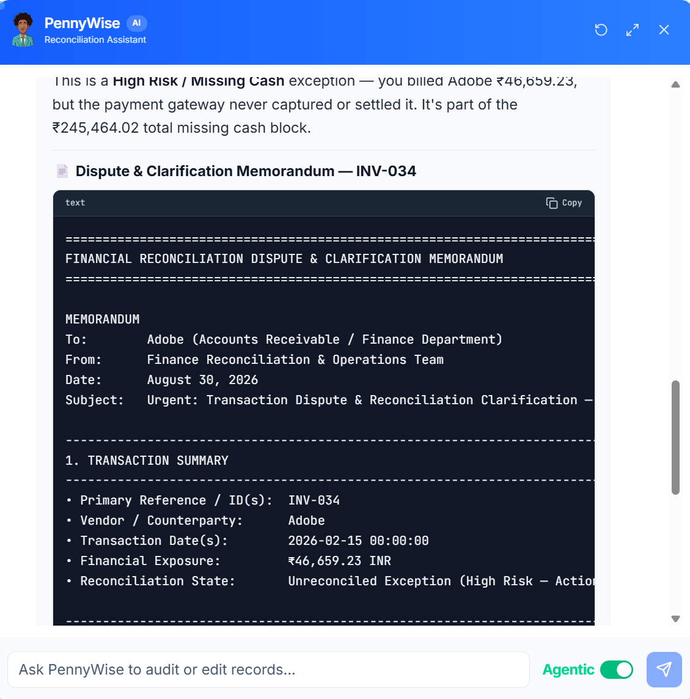 |

| One-Click Gmail Resolution Dispatch | Exception Investigation (Missing Cash) |
|:---:|:---:|
| 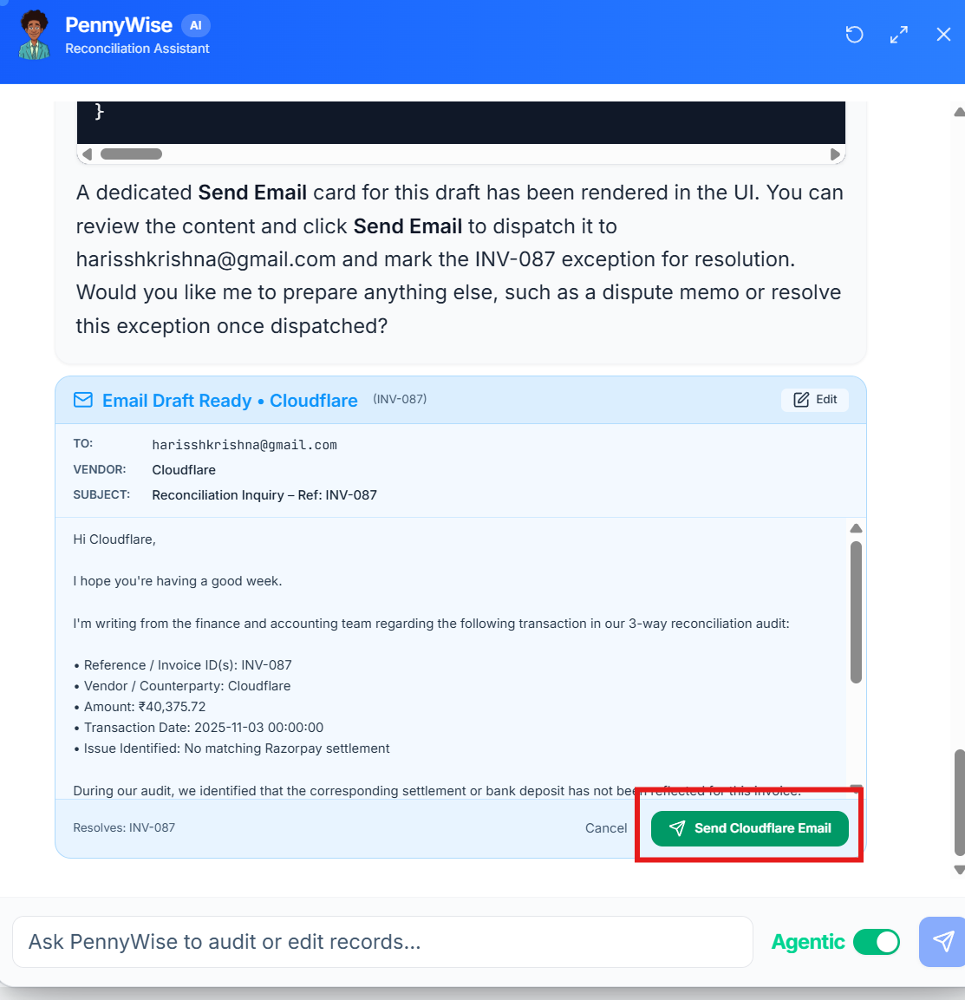 | 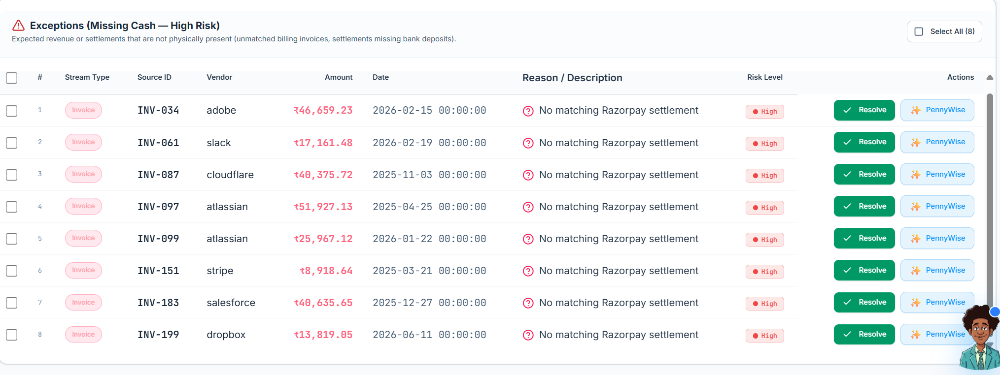 |

| Unallocated Cash Management |
|:---:|
| 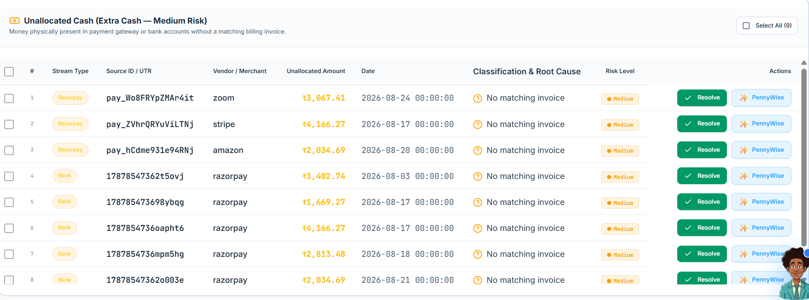 |

---

## Documentation

- [Quick Start Guide](QUICKSTART.md) — Step-by-step installation and local setup.
- [Architecture Deep Dive](ARCHITECTURE.md) — Core matching algorithms, data pipelines, and MCP design.
- [License](LICENSE) — Apache 2.0 License.

---

## License

This project is licensed under the Apache License 2.0. See the [LICENSE](LICENSE) file for details.
